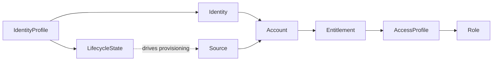

# M0 — Platform model — identities, accounts, access, sources

**Track:** Foundations  
**Est. time:** 2–3 hr  
**Goal:** Design integrations against the correct ISC objects and ownership boundaries  
**Fluency refresh:** Path A `phase-0` in [curriculum.md](../curriculum.md)

## Senior outcomes

- Draw the identity → account → entitlement → access profile → role chain from memory.
- Explain where lifecycle state sits relative to provisioning and sources.
- Decide UI config vs API/SDK vs connector for a given change request.

## When to use

- Kickoff / discovery for any ISC integration
- Architecture reviews where stakeholders confuse accounts with identities
- Choosing between access request, direct entitlement grant, and lifecycle change

## When not

- Deep connector protocol work (see M15–M16)
- Auth token troubleshooting (see M1)
- Version migration planning (see M2 / M19)

## Core content

ISC governs Identities. Accounts are records on Sources. Entitlements hang off accounts/sources. Access profiles bundle entitlements; roles compose business access (often via profiles). Lifecycle states on an identity profile drive joiner/mover/leaver provisioning.

### Platform object graph

*Resolve every object by name at runtime — GUIDs are tenant-specific.*

### Object resolution

| Object | Resolved by | Typical API surface |
| --- | --- | --- |
| Identity | alias / name / email filter | /identities/v1 |
| Account | nativeIdentity + source, or identityId | /accounts/v1 |
| Source | name → id | /sources/v1 |
| Lifecycle state | name on identity profile | identity-profiles …/lifecycle-states |
| Role / AP / entitlement | name → id | /roles/v1, /access-profiles/v1, /entitlements/v2 |

### Who owns the change?

- HR / authoritative source → aggregation + identity profile transforms (batch truth).
- Security / ITDR → API lifecycle or account disable (seconds).
- Business access → access request + approvals (governance).
- Net-new SaaS app → OOTB connector, SaaS Connectivity, or customizer — not a nightly script inventing accounts.

> Never hardcode tenant object IDs. Resolve by name at runtime — IDs differ across sandboxes and prod.

## Failure modes

- Treating account disable on one source as “identity offboarded” without lifecycle.
- Hardcoding lifecycle state or role GUIDs from a sandbox into prod scripts.
- Building per-app disable loops for managed sources that already provision from lifecycle.
- Confusing Search index lag with list-filter freshness for real-time ITDR.

## Enterprise checklist

- [ ] Document authoritative source(s) and lag expectations
- [ ] Name every object type your integration mutates
- [ ] Confirm governance path (request vs lifecycle vs admin API)
- [ ] List tenant-specific names to resolve (states, profiles, sources)
- [ ] Define before/after verification GETs

## Checkpoints

1. **Identity vs account — one sentence each, plus how they relate.**
   - Identity is the person/machine ISC governs. Account is that identity’s record on a specific source. One identity typically has many accounts.
2. **When is access request the wrong tool for removing access?**
   - Leaver / emergency disable should drive lifecycle (or account disable for unmanaged edge cases), not ask the user to request removal. Access request is for governed grant/change with approvals.
3. **Name three extension points that are not “call the public API from a script.”**
   - Transforms, rules, workflows, SaaS Connectivity connectors, connector customizers (any three).

## Interactive learning

Open **Path B → Platform model** in the web app (`#/module/m0`) for full implementation patterns, code samples, and labs.

Runtime source of truth: `web/src/content/implementation/`.
