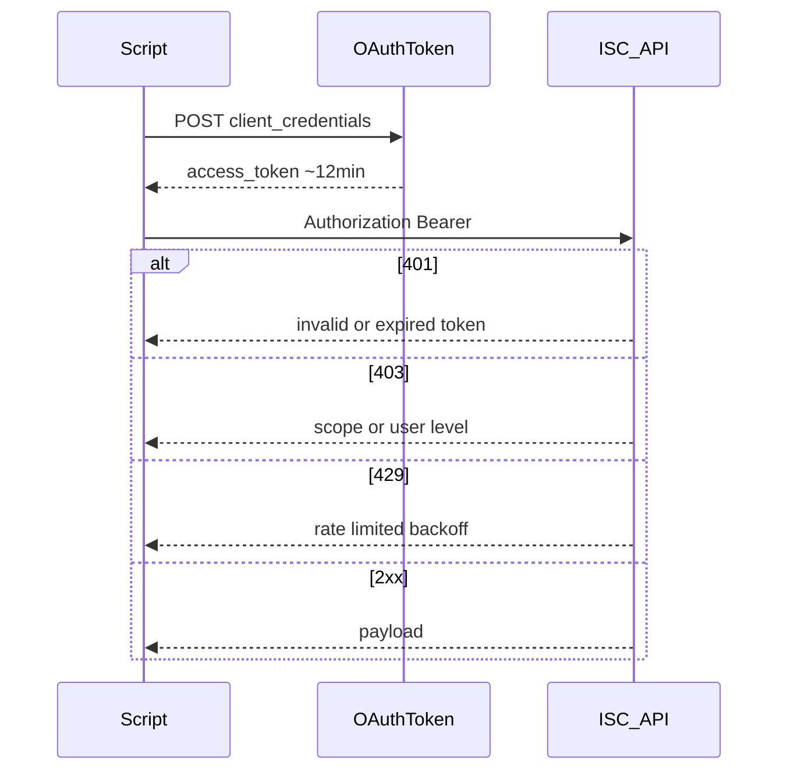

# M1 — Authentication, scopes, and least privilege

**Track:** Foundations  
**Est. time:** 2–3 hr  
**Goal:** Ship PAT-based integrations that fail closed and are diagnosable  
**Fluency refresh:** Path A `phase-1` in [curriculum.md](../curriculum.md)

## Senior outcomes

- Implement client-credentials token acquisition and reuse (~12 min TTL).
- Separate PAT owner user level from OAuth scopes when debugging 403.
- Specify least-privilege scopes per integration, not sp:scopes:all by default.

## When to use

- Any greenfield script, service, or integration-spec for another platform
- Incident response on 401/403/429
- PAT rotation / offboarding of integration identities

## When not

- End-user interactive OAuth for UI apps (different product surface)
- Connector-internal auth to the target SaaS (connector SDK concern)

## Core content

Prefer PAT for scripts and automations. Token endpoint is tenant OAuth; modern client IDs are UUID-with-dashes. Rate limit order of magnitude: ~100 requests per access_token per 10 seconds.

### Auth and error classes

### Scope posture by integration

| Integration | Scope posture |
| --- | --- |
| Read-only reporting | Specific :read scopes |
| ITDR disable | Identity lifecycle + read; document blast radius |
| Access request bot | Request create + status; not admin bypass |
| Migration scanner | Read-heavy; no mutate in dry-run |

### Error classes

- 401 → missing/expired/invalid token (or wrong base URL).
- 403 → token OK but authorization failed: missing scope, insufficient user level, or endpoint needs user context client-credentials cannot supply.
- 429 → back off; reuse one token per run; batch and paginate thoughtfully.

> OS keychain / vault only. Never commit .env, never paste Client Secret into chat or tickets.

## Failure modes

- New token on every request → 429 and latency.
- Legacy undashed client IDs that silently fail auth.
- Assuming 403 means “bad secret” and rotating the wrong credential.
- Shared PAT across unrelated apps — audit and blast-radius nightmare.

## Enterprise checklist

- [ ] Named PAT per integration with owner + rotation date
- [ ] Scopes listed in the runbook / ADR
- [ ] Keyring locally; vault/KMS in prod
- [ ] Revoke on service account offboarding
- [ ] Log correlation / request IDs without logging secrets

## Checkpoints

1. **Walk through obtaining and using a bearer token.**
   - POST /oauth/token with grant_type=client_credentials and PAT client_id/secret. Use access_token as Authorization: Bearer until ~12 min expiry; reuse within a run; SDKs refresh automatically.
2. **Valid token, 403 on access-request create — what do you check first?**
   - Scopes on the PAT, user level of the PAT owner, and whether the endpoint requires a user context that client-credentials cannot provide.

## Interactive learning

Open **Path B → Auth & scopes** in the web app (`#/module/m1`) for full implementation patterns, code samples, and labs.

Runtime source of truth: `web/src/content/implementation/`.
