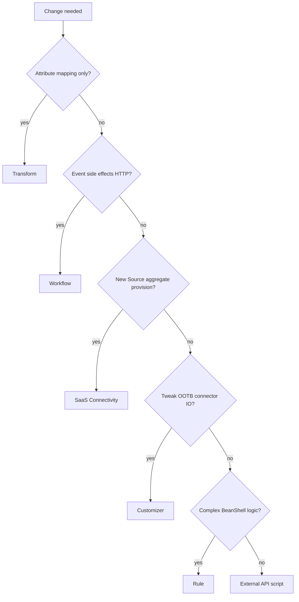

# M12 — Transforms — attribute mapping without code

**Track:** Extensibility  
**Est. time:** 3–4 hr  
**Goal:** Prefer transforms for deterministic attribute calculate/map on aggregate/provision  
**Fluency refresh:** Path A `phase-6` in [curriculum.md](../curriculum.md)

## Senior outcomes

- Author/read transform JSON (type, attributes, input) for common patterns.
- Decide transform vs rule with a clear complexity boundary.
- Reference transforms from identity profiles without hardcoding opaque IDs in docs only — resolve in APIs.

## When to use

- Concat, lower/upper, substring, date format, conditional firstValid/lookup
- Standardizing email, UPN, displayName across sources

## When not

- Multi-source orchestration with approvals (workflow)
- Logic that needs complex loops / external calls beyond transform vocabulary (rule or external)

## Core content

Jumping to BeanShell for lowercase email creates review/install debt transforms avoid. Start at the lightest extension point — the decision tree below is the map for M12–M16.

### Extensibility decision tree

*Transforms → workflows → SaaS connectors → customizers → rules → external API. Prefer the lightest fit.*

### Common transform patterns

- `lower` + `accountAttribute` for normalize email.
- `firstValid` over preferredName then legalName for display names.
- Manage via `TransformsApi.listTransformsV1` (SDK 2.x).

> If a firstValid + lookup + lower can express it, use a transform. Rules are the exception path.

> Docs: https://developer.sailpoint.com/docs/extensibility/transforms

## Failure modes

- Jumping to BeanShell for string normalize.
- Transforms that assume source names differing across tenants without docs.
- Editing transforms in prod without promotion path from sandbox.

## Enterprise checklist

- [ ] Naming convention for transforms
- [ ] Sandbox → prod promotion process
- [ ] Identity profile mapping review
- [ ] Test identities for before/after attributes

## Checkpoints

1. **Transform or rule for lowercasing HR email?**
   - Transform (type lower / accountAttribute input). Rule is unnecessary.
2. **What SDK 2.x method lists transforms?**
   - TransformsApi.listTransformsV1 (sailpoint-api-client 2.x).

## Interactive learning

Open **Path B → Transforms** in the web app (`#/module/m12`) for full implementation patterns, code samples, and labs.

Runtime source of truth: `web/src/content/implementation/`.
