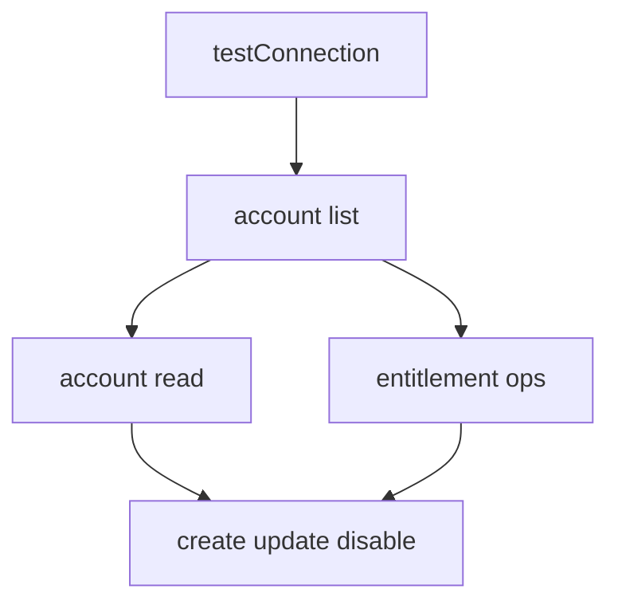

# M15 — SaaS Connectivity — custom TypeScript connectors

**Track:** Extensibility  
**Est. time:** 4–5 hr  
**Goal:** Build or evaluate custom cloud connectors with connector-sdk + spcx  
**Fluency refresh:** Path A `phase-6` in [curriculum.md](../curriculum.md)

## Senior outcomes

- Explain when OOTB is insufficient and SaaS Connectivity is justified.
- Sketch connector command handlers (test connection, account list/read, entitlement, provision).
- Use spcx for local debug; know loopback connector pattern.

## When to use

- SaaS app with no OOTB connector, reachable from SailPoint cloud
- Loopback: ISC managing ISC via API for specialized scenarios

## When not

- On-prem only systems needing VA/classic connectivity patterns
- Simple nightly API job that does not need source aggregation semantics

## Core content

If ISC must aggregate accounts/entitlements and provision as a Source, you need a connector. If you only need to call ISC when ITDR fires, you need an external integration (M4/M8/M9), not a connector. Implementing provision before you can list/read accounts leaves you unable to aggregate or reconcile.

### Connector command lifecycle

*testConnection → account list → read / entitlement ops → create/update/disable. Prove aggregation before provisioning.*

### Connector pattern

- Handlers via `@sailpoint/connector-sdk` (`StdAccountList`, `StdAccountCreate`, …).
- Local debug with spcx; deploy via SailPoint connector packaging flow.
- Loopback connectors drive ISC via its own API — require ADR + rate-limit design.

> https://github.com/sailpoint-oss/sp-connector-sdk-js

## Failure modes

- Building a connector for a one-way ticket create that should be a workflow HTTP action.
- Blocking aggregation on chatty unpaginated remote APIs.
- Storing long-lived SaaS secrets in source config without rotation plan.

## Enterprise checklist

- [ ] Target reachable from SailPoint cloud
- [ ] Account/entitlement schema designed before code
- [ ] spcx test evidence attached to PR
- [ ] Provisioning operations mapped to ISC plan ops
- [ ] Owner team for connector version upgrades

## Checkpoints

1. **When is a loopback connector appropriate?**
   - When ISC must manage ISC-shaped resources through source aggregation/provisioning semantics — not as a substitute for ordinary API scripts. Requires careful rate limits and ADR.
2. **API SDK or Connector SDK for a new SaaS HR app with no OOTB connector?**
   - Connector SDK / SaaS Connectivity if it should be an ISC Source.

## Interactive learning

Open **Path B → SaaS Connectivity** in the web app (`#/module/m15`) for full implementation patterns, code samples, and labs.

Runtime source of truth: `web/src/content/implementation/`.
