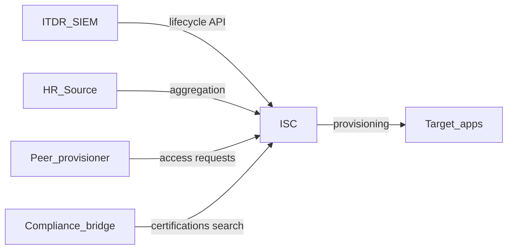

# M17 — Architecture patterns for ISC integrations

**Track:** Senior delivery  
**Est. time:** 3–4 hr  
**Goal:** Pick durable patterns: sync vs async, ownership, and anti-corruption boundaries  
**Fluency refresh:** Path A `phase-7` in [curriculum.md](../curriculum.md)

## Senior outcomes

- Draw reference architectures for ITDR, JML bridge, and peer provisioner.
- Separate ISC domain language from upstream HR/ITSM models (anti-corruption).
- Choose sync request/response vs queue/workflow handoff deliberately.

## When to use

- Solution architecture / ADR kickoff
- Multi-system programs (HR + ITSM + ISC + SOAR)

## When not

- Single filter syntax questions (M5)
- One-off Postman exploration

## Core content

Without a shared picture, teams reinvent point-to-point scripts — ITDR calling Search, HR PATCHing the same attributes a connector owns, and peer clone bypassing approvals.

### Reference architecture sketch

*ITDR/SIEM → lifecycle API; HR → aggregation; ISC → target apps; peer provisioner → access requests; compliance → certifications/search.*

### Reference patterns

| Pattern | Skeleton |
| --- | --- |
| ITDR disable | SOAR → REST/SDK → resolve identity → set Terminated → verify |
| Compliance bridge | Scheduler → CSV/API → rules engine → lifecycle/requests → dry-run |
| Peer provisioner | HR event → compare peer access → access requests → approvals |
| Source of truth | Connector aggregate → transforms → identity → provision out |

### Design principles

- Anti-corruption: map external employeeStatus → ISC lifecycle names explicitly.
- Idempotency: key on identity id + desired state; safe retries.
- Async provisioning: HTTP success ≠ all accounts disabled yet — design verification windows.

### ADR minimum contents (July 2026)

- Auth: PAT per integration; vault; scopes
- Versioning: /service/vN only; SDK 2.x
- Runtime: language + SDK vs REST caller
- Dry-run, verify GET, observability
- Migration deadline awareness (Q2 2028 / Q1 2029)

## Failure modes

- Point-to-point scripts with no owner or SLO.
- Leaking HR enums straight into lifecycle APIs.
- Dual writers (HR aggregate + API PATCH) fighting on same attributes.

## Enterprise checklist

- [ ] Architecture diagram in repo
- [ ] ADR accepted by security + IAM
- [ ] Failure/retry matrix
- [ ] Data retention / PII logging policy
- [ ] Environment promotion path

## Checkpoints

1. **What belongs in a July 2026 ISC integration ADR?**
   - Auth/secrets, SDK vs REST, per-service version pins, dry-run/verify, observability, and migration deadline posture.
2. **Why use an anti-corruption layer for HR status?**
   - HR enums ≠ ISC lifecycle names; explicit mapping prevents silent wrong state transitions across tenants.

## Interactive learning

Open **Path B → Architecture** in the web app (`#/module/m17`) for full implementation patterns, code samples, and labs.

Runtime source of truth: `web/src/content/implementation/`.
