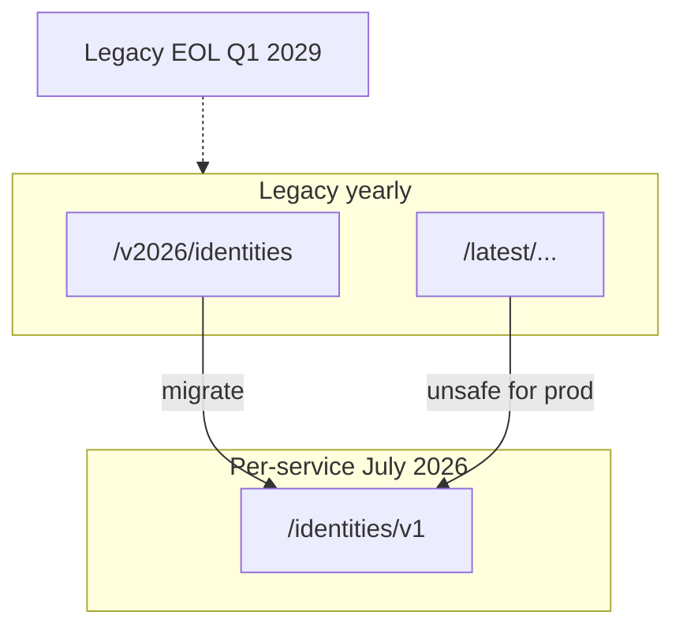

# M2 — API versioning — per-service vN vs legacy yearly

**Track:** Foundations  
**Est. time:** 3–4 hr  
**Goal:** Advise greenfield pins and brownfield migration with July 2026 facts  
**Fluency refresh:** Path A `phase-2` in [curriculum.md](../curriculum.md)

## Senior outcomes

- Map /v2026/{resource} → /{resource}/vN using the official migration table.
- Explain why /latest is unsafe for production under the new strategy.
- State support (through Q2 2028) and hard EOL (Q1 2029) for legacy yearly/v3/beta.

## When to use

- Any new integration design review
- Inventory of existing scripts, workflows, and ServiceNow integrations
- SDK major-version upgrades

## When not

- Choosing transform vs rule (extensibility track)
- Debugging filter syntax (M5)

## Core content

Greenfield pins to per-service /resource/vN. Brownfield inventories scripts and workflow HTTP actions, then migrates before Q1 2029 EOL. /latest is an unsafe production alias under the July 2026 strategy.

### Dual-world migration

### Migration posture

- Greenfield: pin /service/vN in REST; use SDK 2.x *V1/*V2 methods.
- Brownfield: run TS/Python/Go/PS migration scripts; review V2 outliers manually.
- Workflows: scan HTTP actions with Workflow Analyzer — legacy paths hide in low-code.

### Path shapes

- Prefer: `/accounts/v1`, `/identities/v1`, `/entitlements/v2` (check migration table for outliers).
- Legacy until Q1 2029: `/v2026/accounts`, `/v3/...`, `/latest/...` (avoid `/latest` in production).

> Yearly collections forced churn without contract breaks. Majors bump only on breaking changes; services version independently.

## Failure modes

- Shipping /latest because “it always follows current” — silent break on flip.
- Assuming every legacy path maps to v1 (entitlements and some config → v2).
- Migrating SDK classes but leaving workflow HTTP actions on /v2025.
- Treating EOL as “2029 problem” with no inventory before support ends Q2 2028.

## Enterprise checklist

- [ ] Path inventory: scripts, SDKs, workflows, ITSM, RPA
- [ ] Official migration table applied; V2 outliers flagged
- [ ] No new /latest or yearly paths in CI templates
- [ ] Experimental endpoints gated and non-prod by default
- [ ] Watch X-Deprecated: true in observability

## Checkpoints

1. **Map /v2026/accounts and /latest/identities to current paths.**
   - /accounts/v1 and /identities/v1. Prefer explicit service versions; do not keep /latest.
2. **What are the legacy support and EOL dates you quote to leadership?**
   - Support tickets for Beta/V3/yearly through Q2 2028; endpoints stop functioning Q1 2029.
3. **Show the TypeScript 2.x naming pattern for listing accounts.**
   - AccountsApi + listAccountsV1(…) from sailpoint-api-client 2.x (resource API + version suffix).

## Interactive learning

Open **Path B → Versioning** in the web app (`#/module/m2`) for full implementation patterns, code samples, and labs.

Runtime source of truth: `web/src/content/implementation/`.
