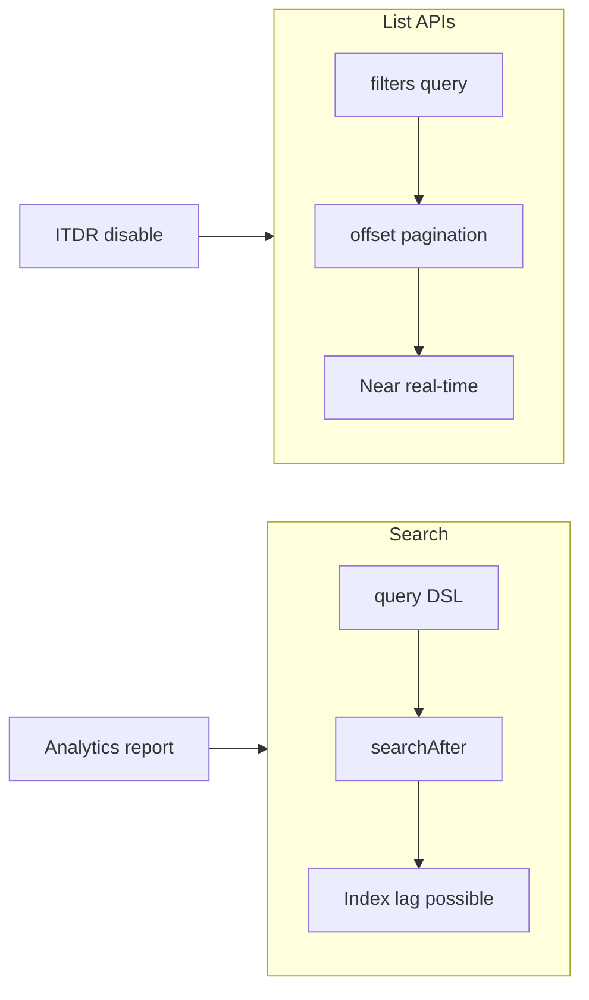

# M5 — Filters, Search, PATCH, and bulk patterns

**Track:** API craft  
**Est. time:** 3–4 hr  
**Goal:** Query and update at enterprise scale without foot-guns  
**Fluency refresh:** Path A `phase-3` in [curriculum.md](../curriculum.md)

## Senior outcomes

- Write standard collection filters with eq/sw/co/in/and and correct quoting.
- Choose list filters vs Search (searchAfter) for the right workload.
- Apply JSON Patch (application/json-patch+json) and respectful bulk/pagination.

## When to use

- Lookups by alias, status, source, created date
- Reporting and reconciliation jobs
- Partial updates where PUT would clobber fields

## When not

- Real-time disable when you already have the identity id (skip search theater)
- Replacing governed access changes with blind PATCH of assignments

## Core content

Picking Search for an ITDR disable can hit index lag and miss the identity you must act on now; picking list+offset for a million-row analytics dump burns rate budget and time.

### Search vs list — choose by workload

*ITDR and simple alias lookups prefer list filters (near real-time). Wide analytics prefer Search + searchAfter (accept index lag).*

### Filter examples

- `alias eq "Jennifer.Thomas"`
- `name sw "John"`
- `firstname sw "john" and status eq "ACTIVE"`
- `created gt 2025-01-01T00:00:00Z`
- `name in ("Alice","Bob")`
- `identityId eq "abc-123"`

### Search vs list; PATCH vs bulk

- List + filters: resource collections, simpler predicates, pagination via limit/offset.
- Search: index query language; limit up to 10k then searchAfter — great for wide reporting, not a substitute for knowing index lag.
- PATCH: JSON Patch ops (add/replace/remove) with Content-Type `application/json-patch+json`.
- Bulk: batch within rate limits; prefer server bulk endpoints when documented; verify samples after.

> Standard collection parameters: https://developer.sailpoint.com/docs/api/standard-collection-parameters

## Failure modes

- Unquoted strings in filters → 400.
- Using Search for ITDR path that needs authoritative identity GET.
- PUT entire objects from stale GETs → lost updates.
- offset deep pagination on huge sets without measuring cost.

## Enterprise checklist

- [ ] Filter library reviewed against spec for each resource
- [ ] Pagination strategy documented (limit/offset vs searchAfter)
- [ ] 429 retry with jitter; token reuse
- [ ] PATCH content-type enforced in client
- [ ] Bulk job has dry-run + progress metrics

## Checkpoints

1. **Filter: identity alias equals Jennifer.Thomas**
   - alias eq "Jennifer.Thomas"
2. **When do you use Search instead of list_identities filters?**
   - Broad/index-oriented queries and large result sets needing searchAfter. Prefer list filters for simple identity lookups by alias/id when the collection API supports them.
3. **What Content-Type does ISC PATCH require?**
   - application/json-patch+json with a JSON Patch document body.

## Interactive learning

Open **Path B → Filters & bulk** in the web app (`#/module/m5`) for full implementation patterns, code samples, and labs.

Runtime source of truth: `web/src/content/implementation/`.
