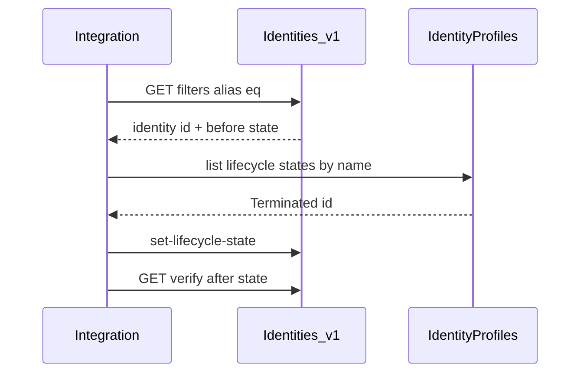

# M6 — Identities, accounts, lifecycle, and sources

**Track:** API craft  
**Est. time:** 4–5 hr  
**Goal:** Implement JML and emergency disable against the right APIs  
**Fluency refresh:** Path A `phase-3` in [curriculum.md](../curriculum.md)

## Senior outcomes

- Resolve identity by alias; resolve lifecycle state by name on the profile.
- Explain account vs identity disable and when each is appropriate.
- Account for aggregation latency vs API-driven action.

## When to use

- Joiner/mover/leaver automations
- ITDR emergency disable
- Source/account reconciliation jobs

## When not

- Granting business roles (use access requests — M7)
- Building a custom HR connector (M15) when you only needed a lifecycle API

## Core content

Hardcoding a Terminated GUID works once in sandbox and fails silently in prod; skipping the verify GET closes the ticket while provisioning may still be in flight.

### Emergency disable / leaver sequence

*Resolve identity → resolve lifecycle state by name → set state → GET before/after. Never hardcode tenant GUIDs.*

### Accounts & sources

- Accounts live on sources; filter by identityId or native identity + source.
- Aggregation pulls truth on a schedule — do not wait for HR file when security needs now.
- Unmanaged / break-glass sources may need direct account disable in addition to lifecycle.
- Prefer `/accounts/v1` and `/sources/v1` pins in new work.

> For emergency disable set lifecycle to Terminated (resolved by name) so ISC provisions disables downstream.

## Failure modes

- Hardcoding LeaveOfAbsence / Terminated GUIDs.
- Disabling one AD account and declaring the identity offboarded.
- No verify GET — ticket closed on HTTP 202 alone.
- Race with aggregation overwriting an attribute you PATCHed on the account.

## Enterprise checklist

- [ ] Identity correlation attributes documented
- [ ] Lifecycle state name map per identity profile
- [ ] Before/after evidence in run logs
- [ ] Source owners notified for unmanaged exceptions
- [ ] Dry-run mode for bulk JML jobs

## Checkpoints

1. **What's wrong with hardcoding LeaveOfAbsence's ID?**
   - IDs are tenant-specific and differ by environment. Resolve by name from the identity profile’s lifecycle states each run.
2. **ITDR needs disable now — why isn’t waiting for the next HR file enough?**
   - HR aggregation is batch/slow. Compromised accounts need immediate API-driven lifecycle or disable — seconds, not the next file cycle.

## Interactive learning

Open **Path B → Identities & lifecycle** in the web app (`#/module/m6`) for full implementation patterns, code samples, and labs.

Runtime source of truth: `web/src/content/implementation/`.
